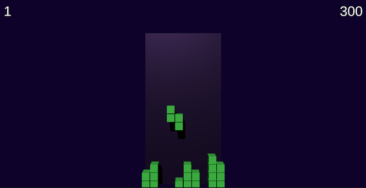

# Tetris Game

## Description

Implementation of classic Tetris game using Unity engine.

Player needs to combine falling figures on limited field to create full lines,
which add scores. Game is finished when a new figure cannot be placed on field.

You can play it [here](https://konhit.xyz/TetrisGame/).

## Controls

- **Up** - rotate
- **Left/Right** - move left/right
- **Down** - speed up (move down one unit)

## Features

- Keyboard input
- Simple 3D graphics
- Local leaderboard
- Player/AI mode
- Animations
- Sounds

## Architecture

- **EntryPoint** - composition of presenters and GameLoop
- **Presenter** - views to reflect read only game state changes
- **Service** - game logic, separated to different classes; uses writable game state; GameLoop as a services composition
- **Settings** - required configuration, separated to global and scene settings 
- **State** - raw game data, separated to writable and read only representations

# AI

- **Editor/GeneticTrainer** - genetic algorithm trainer to detect better AI parameters
- **Service/GeneticPlayer** - AI implementation selecting better movements based on set of parameters
- **Service/GeneticDebugger** - AI debug utility to investigate move selection logic using game logs in html format:

## Credits

Assets used:
- [Arcade Coin-Up II](https://freesound.org/people/MattiaGiovanetti/sounds/482083/) by MattiaGiovanetti
- [redux-demo-session-11-08-2018/stick.wav](https://freesound.org/people/herraportti/sounds/436668/) by herraportti
- [game over](https://freesound.org/people/Leszek_Szary/sounds/133283/) by Leszek_Szary